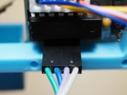

# Assembly instructions

## Mount the motor drivers

Turn the head face-down, and place a stepper driver face-down in
the bottom left-hand corner, with the four LEDs on the driver towards
the top of the head. Secure with two M3 screws, then repeat with the other
stepper driver in the bottom right-hand corner of the head.

## Attach the motors

With the head still face-down, turn one of the stepper motors axle-down
and mount it with two M3 screws to the left eye socket. The motor's wires
should point towards the bottom of the head, and slightly to the left.
Mount the other stepper motor to the right eye socket.

## Attach the strings

Cut two long pieces of thread. Find the two holes in the rim of one
of the rotors. Starting from outside the rotor, insert the end of the
thread into one hole, then pass it between the spokes, then bring
it back out through the other hole.

Tie a knot in the thread and cut off the excess.

Tie the other end of the thread to one of the suction cups, and wind the thread around
the rotor.

Repeat with the other rotor, thread, and suction cup.

## Mount the rotors

Turn the head face-up, and orient one rotor so that the thread winds
counter-clockwise around it. Press the rotor onto the axle of the left motor.
It should be a snug fit, and may require some force.
Pass the thread through the thread guide.

Mount the right rotor, oriented so that its thread winds clockwise. When
passing its thread through the thread guide, cross it over the left
rotor's thread.

Wind the motor wires around the sides of the head to use up the excess,
then plug them into the motor drivers.

Making sure that the threads are crossed, place the forehead piece over
the threads and attach it with two M3 screws. Don't attach the middle screw yet!

## Mount the servo

Turn the head face-down, and mount the servo bracket to the back of the head with
two M3 screws.
The servo attachment points should be on the right, and extend above the top
of the head as shown.

The top screw of the servo mount must be at least 12mm, so it is long enough to
extend through the forehead.

Insert the servo into its bracket from the right, with the servo axle towards the bottom of the head.
Fasten the servo to its bracket with two M2 screws, passing them through the servo's screw holes first
and then into the bracket.

## Attach the battery box

Attach the 9v battery connectors to the voltage converter and the power switch:
1. Solder the two positive wires from the battery connectors to center pin of the switch.
2. Join the two negative wires from the battery connector, and crimp on a ring terminal.
3. Solder a wire from one of the other switch pins to the "IN+" pin of the voltage converter.
4. Solder wires to the "GND" and "VO+" pins of the voltage converter, and crimp ring terminals
   to the other ends.

Using a hot glue gun, glue the voltage converter and the power switch to their mounting points
at the bottom left of the battery box.

Turn the head face-down, and use an M3 screw to attach the battery box to the bottom part of
the head, between the two stepper drivers.

## Attach the pen holder

Using M3 screw, attach the two spring clips to the nose.

## Wire up the stepper drivers

Connect the stepper drivers to the dev board, paying close attention to the orientation.
Each stepper driver has four pins in its bottom left-hand corner; pin 1 is on the left and pin 4 is on the right.
Connect pins 1, 2, 3, and 4 of the left stepper driver to pins 0, 1, 2, and 3 respectively on the
dev board. Connect pins 1, 2, 3, and 4 of the right stepper driver to pins 4, 5, 6, and 7 respectively
on the dev board.

Cut and strip the ends of the servo motor wires. Crimp ring terminals to the ends of the red and brown
wires, and crimp a DuPont connector to the end of the yellow wire. Plug the yellow wire into pin 10 of
the dev board.

Prepare two 2x1 DuPont connectors for providing power to the stepper drivers: first, crimp a power wire and
a ground wire to each connector. Join the two power wires and crimp them to a ring terminal, then join the
two ground wires and crimp them to another ring terminal.

## Wire up the power

Plug the stepper power connectors into the stepper drivers.

Prepare a 3x1 DuPont connector for providing power to the dev board. Leaving the middle pin empty, crimp
a power wire and a ground wire into the two outer pins.

Plug in the dev board power so that the power wire connects to the pin labeled "5V" and the ground wire
connects to one of the pins labeled "G".

Gather all the 5V power wires (the red wire from the servo, the wire from the "VO+" pin of the voltage converter,
the stepper driver power wires, and the dev board power wire). Put an M3 screw through the ring terminals of all
these wires and screw it into the left hole on the battery box.

Gather all the ground wires (the brown wire from the servo, the wire from the "GND" pin of the voltage converter,
the stepper driver ground wires, the dev board ground wire, and the wire from the negative 9V battery terminal).
Put an M3 screw through the ring terminals of all
these wires and screw it into the right hole on the battery box.

Plug 9v batteries into the battery connectors, and put them in the battery box.

## Align the servo motor

Turn on the power switch. The first two leds on each stepper motor should light up, and you should here
a sound as the servo moves into position. Turn the power switch off again.

Now that the servo has found its position, attach the little plastic piece to the servo axle so that it
points perpendicularly out from the back of the head.

And that's it! Your Bradipograph is assembled and ready to draw.
