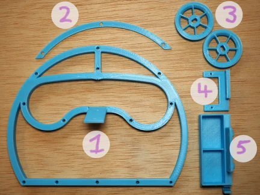
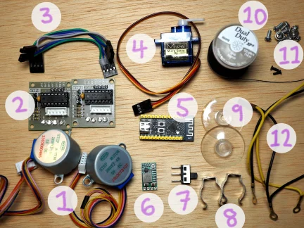

# List of materials

## 3d printed parts

STL files for 3d printing are available [here](https://github.com/jneem/bradipograph/releases/tag/latest).
The required tolerances are not very tight; any reasonable print settings should be fine.

1. head
2. forehead
3. rotors (you'll need two copies)
4. servo mount
5. battery box

## Other parts

Here is a picture of most of the other parts you'll need (I forgot to include the batteries). I've tried
to include Amazon and AliExpress purchase links where possible, but they tend to go stale. See the [Notes](#notes)
section for more details on the parts, and some advice on substitutions.

1. two stepper motors (28BYJ-48) ([amazon](https://www.amazon.com/ELEGOO-28BYJ-48-ULN2003-Stepper-Arduino/dp/B01CP18J4A/ref=sr_1_1?keywords=28BYJ-48&qid=1707022786&sr=8-1), [aliexpress](https://www.aliexpress.us/item/2251832520244758.html?spm=a2g0o.productlist.main.7.7fd4180bhjP6u2&algo_pvid=2b9e5e70-9c59-4e9e-bd6b-3d315d5e1381&algo_exp_id=2b9e5e70-9c59-4e9e-bd6b-3d315d5e1381-3&pdp_npi=4%40dis%21USD%210.99%210.99%21%21%210.99%210.99%21%40210307bf17070228839968323ed889%2165393747646%21sea%21US%212191644272%21&curPageLogUid=J0wE2HdqrHqM&utparam-url=scene%3Asearch%7Cquery_from%3A))
2. two stepper motor drivers (ULN2003); often sold in combination with the motors
3. the wires that came with my stepper motors and drivers. You can also just supply your own wires.
4. servo motor (sg90) ([amazon](https://www.amazon.com/Hosyond-Helicopter-Airplane-Control-Arduino/dp/B09GFN98X9/ref=sr_1_9?keywords=sg90%2Bservo%2Bmotor&qid=1707023094&sr=8-9&th=1), [aliexpress](https://www.aliexpress.us/item/3256806217912283.html?spm=a2g0o.productlist.main.1.a850f47bqYAatt&algo_pvid=0a2a8330-20c2-4e52-bcf4-e2a4fce2aa7f&algo_exp_id=0a2a8330-20c2-4e52-bcf4-e2a4fce2aa7f-0&pdp_npi=4%40dis%21USD%2114.55%214.83%21%21%21104.03%2134.54%21%402101eab017070230477298791ec4df%2112000037043715430%21sea%21US%212191644272%21&curPageLogUid=niiMdVDdNZHG&utparam-url=scene%3Asearch%7Cquery_from%3A))
5. ESP32-C3FH4 dev board by WeAct Studio ([aliexpress](https://www.aliexpress.us/item/3256804996835770.html?spm=a2g0o.productlist.main.1.992e511cWBhqBg&algo_pvid=2462f9fc-665b-42e7-94fa-4ddd9605e301&algo_exp_id=2462f9fc-665b-42e7-94fa-4ddd9605e301-0&pdp_npi=4%40dis%21USD%217.79%212.49%21%21%2155.71%2117.83%21%402101efab17070231736351211eca54%2112000032023973869%21sea%21US%212191644272%21&curPageLogUid=1BrKpnaDG2ji&utparam-url=scene%3Asearch%7Cquery_from%3A))
6. DC step down converter, 5v output ([amazon](https://www.amazon.com/gp/product/B08JZ5FVLC/ref=ppx_yo_dt_b_search_asin_title?ie=UTF8&psc=1), [aliexpress](https://www.aliexpress.us/item/3256805479283495.html?spm=a2g0o.productlist.main.13.197c7e74Lkp8Kx&algo_pvid=20c7437e-a79a-454e-a6ee-03eadbf41c04&algo_exp_id=20c7437e-a79a-454e-a6ee-03eadbf41c04-6&pdp_npi=4%40dis%21USD%214.57%212.42%21%21%2132.68%2117.32%21%402101f01817070233176942210ede33%2112000033966657876%21sea%21US%212191644272%21&curPageLogUid=lkwSz6HvCfGE&utparam-url=scene%3Asearch%7Cquery_from%3A))
7. Power switch ([amazon](https://www.amazon.com/gp/product/B099N61GTZ/ref=ppx_yo_dt_b_search_asin_title?ie=UTF8&psc=1), [aliexpress](https://www.aliexpress.us/item/2255801021214741.html?spm=a2g0o.productlist.main.1.5add43e8HQA3Qo&algo_pvid=5c8115ad-f507-4797-ac0c-dd5c97575411&algo_exp_id=5c8115ad-f507-4797-ac0c-dd5c97575411-0&pdp_npi=4%40dis%21USD%210.80%210.78%21%21%210.80%210.78%21%402101e64117070238443497698e0439%2110000015300780421%21sea%21US%212191644272%21&curPageLogUid=bPGRczJz4lgj&utparam-url=scene%3Asearch%7Cquery_from%3A))
8. Terry clips, big enough to firmly hold your markers ([amazon](https://www.amazon.com/Terry-Clips-Plastic-Coated-Spring/dp/B09MWGG883/ref=sr_1_12?crid=BN037QQD76RQ&keywords=15mm+terry+clips&qid=1707074083&sprefix=15mm+terry+clips%2Caps%2C98&sr=8-12), [aliexpress](https://www.aliexpress.us/item/3256805934884969.html?spm=a2g0o.productlist.main.1.627a2060kGbUZX&algo_pvid=55fc1bad-e88d-4560-85bc-3fcf155f4f96&algo_exp_id=55fc1bad-e88d-4560-85bc-3fcf155f4f96-0&pdp_npi=4%40dis%21USD%211.50%210.99%21%21%2110.72%217.08%21%402101eab017070741413912585ed0aa%2112000035847275021%21sea%21US%210%21AB&curPageLogUid=AFYCDCSl92PC&utparam-url=scene%3Asearch%7Cquery_from%3A))
9. Suction cups, ([amazon](https://www.amazon.com/Pawfly-Suction-Without-Decoration-Organization/dp/B08ZS7MV1K/ref=sr_1_6?crid=1Y3JGXNVB0CS0&keywords=suction%2Bcups&qid=1707074357&sprefix=suction%2B%2Caps%2C111&sr=8-6&th=1))
10. Thread (or fishing line)
11. A bunch of M3 screws, and two M2 screws.
12. Assorted wires, with "Dupont" style connectors and ring terminals ([amazon](https://www.amazon.com/IWISS-1550PCS-Connector-Headers-Balancer/dp/B08X6C7PZM/ref=sr_1_10?crid=1ABQJZ94QSUXG&keywords=dupont+connector+kit&qid=1707074570&sprefix=dupont+%2Caps%2C111&sr=8-10), [amazon](https://www.amazon.com/Terrans-Non-Insulated-Terminals-Tin-Plated-Assortment/dp/B0732XSDQX/ref=sr_1_16?crid=3MGYZLJ0DARKQ&keywords=ring+terminals+24awg&qid=1707074714&sprefix=ring+terminals+24awg%2Caps%2C88&sr=8-16), [aliexpress](https://www.aliexpress.us/item/3256805929468763.html?spm=a2g0o.productlist.main.1.58b43202D8mG3o&algo_pvid=18f55fb2-cc7f-4eec-98ef-a1df84ab0364&algo_exp_id=18f55fb2-cc7f-4eec-98ef-a1df84ab0364-0&pdp_npi=4%40dis%21USD%2112.38%210.99%21%21%2188.51%217.09%21%40210324e517070747892602817e0cc6%2112000035821465470%21sea%21US%210%21AB&curPageLogUid=BqO3fzQb73us&utparam-url=scene%3Asearch%7Cquery_from%3A), [aliexpress](https://www.aliexpress.us/item/3256806062864141.html?spm=a2g0o.detail.pcDetailTopMoreOtherSeller.4.3424bZq9bZq9PQ&gps-id=pcDetailTopMoreOtherSeller&scm=1007.40050.354490.0&scm_id=1007.40050.354490.0&scm-url=1007.40050.354490.0&pvid=83674697-4719-4718-81c2-e83413735ee2&_t=gps-id:pcDetailTopMoreOtherSeller,scm-url:1007.40050.354490.0,pvid:83674697-4719-4718-81c2-e83413735ee2,tpp_buckets:668%232846%238112%231997&pdp_npi=4%40dis%21USD%216.95%210.99%21%21%2149.67%217.04%21%402103010f17070748616161250eef4e%2112000036464995086%21rec%21US%21%21AB&utparam-url=scene%3ApcDetailTopMoreOtherSeller%7Cquery_from%3A))
13. Two 9v rechargeable batteries, and two 9v battery connectors (not pictured)

## Tools and equipment

- soldering iron
- 3d printer
- screwdriver
- hot glue gun
- tool for cutting and stripping wire
- crimping tool
- USB-C data cable
- computer

## Notes

### Motors and servos

28BYJ-48 stepper motors are made by many manufacturers, and often packaged
with ULN2003 drivers.
As of me writing this, a pack of 5 motors and 5 drivers is available
for $15 on Amazon or $10 on AliExpress.

The pen is lifted with an SG90 servo, which is also made by many manufacturers. A 5-pack costs about $10 on Amazon,
or $5 on AliExpress.

### The batteries

I'm using two rechargeable 9v Li-ion batteries. At about $20 for a 4-pack
on Amazon, this is definitely the most expensive part. You'll also need two 9v
battery connectors with wire leads. A 10-pack is about $5 on Amazon.

### Power supply

We'll power the device with 9v batteries, but that 9v needs to be converted
down to 5v. Adjustable DC step-down converters are available in packs
of 5 for about $10 on Amazon or $5 on AliExpress. Any cheap converter should be
fine; we won't draw much current.

### The brains

The device is controlled by an ESP32-C3 chip. Development boards with ESP32-C3
chips are available on AliExpress for as little as $2. There doesn't seem to
be much difference between the different boards except for the locations of the
various pins; probably any of them
will work. But if you want to use the exact same board as me, I'm using
WeAct Studio's ESP32-C3FH4 Core Board. This seems to be available only on AliExpress.

### Pen holder

I'm using two terry clips to hold the marker in place. You can also use a binder clip,
a rubber band, or anything else that holds the pen firmly in place.

### Wiring

I cut my own wires to approximately the correct length; I connected the wires to the
various devices using "Dupont"-style connectors, and I connected the power wires
to one another using a screw and ring terminals. You can of course use pre-cut and
pre-crimped wires if you prefer.

### String

You'll need a few meters of string for hanging the device. Ordinary sewing thread works well
(it isn't very heavy), as does fishing line.
